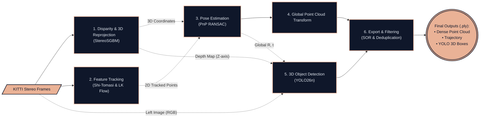

# 🚘 Robust Epipolar Geometry Estimation for Autonomous Driving using Foundation Models (DINOv2)
## 🔍 Overview
This project evaluates the robustness of classical feature extraction methods (SIFT) and foundation models (DINOv2) for pose estimation in autonomous driving and 3D mapping. Moreover, it provides a complete pipeline combining theoretical feature matching methods with a real-world 3D perception application, developed as a personal project during my master's studies in Computer Vision and Image Processing at CTU in Prague (ČVUT).

The project consists of two main steps:
* **Classical Methods vs. Foundation Models:** Comparatively analyzing classical feature extraction methods (SIFT) and foundation models (DINOv2).
* **Visual Odometry Pipeline:** Building a complete monocular visual odometry pipeline using the better-performing method on the KITTI Vision Benchmark Suite.

## 🤼 Classical Methods vs. Foundation Models (04_evaluation_comparison.ipynb)
A critical component of this project was evaluating the robustness of feature matching for Fundamental Matrix estimation. I compared the classical SIFT algorithm against DINOv2 foundation model.

Evaluation results showed that DINOv2 outperformed SIFT in all metrics:
| Method | Inlier Points | Median Symmetric Distance | Median Sampson Error | Mean Sampson Error | Max Sampson Error |
| :--- | :--- | :--- | :--- | :--- | :--- |
| **SIFT** | 925 | 1.749018e+00 | 4.434024e-01 | 7.522841e-01 | 4.401623e+00 |
| **DINOv2** | 965 | 2.323716e-20 | 5.915444e-21 | 9.867080e-21	 | 6.021459e-20 |

## ⚙️ Visual Odometry Pipeline

